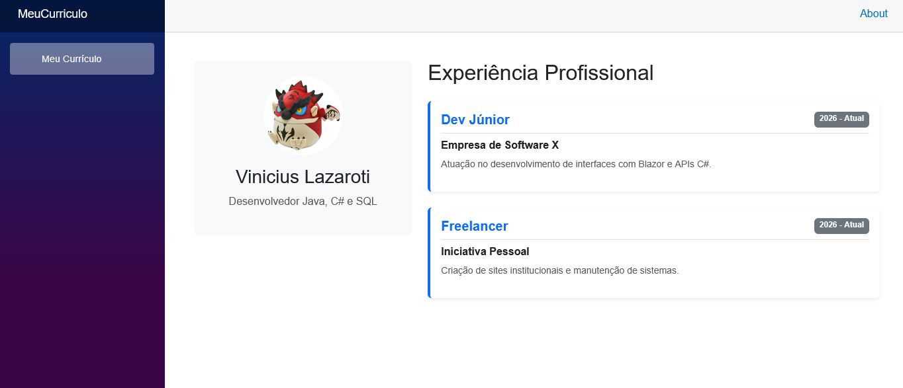

# Identificação
Nome do aluno: Vinicius Amaral Lazaroti

Curso: Análise e Desenvolvimento de Sistemas

# Guia de Execução

Após o download, use o comando cd para acessar a pasta no terminal (prompt de comando) e utilize o comando "dotnet run" para obter o endereço do host. Coloque o endereço no navegador de sua preferência.

Para acesso rápido: http://localhost:5244

# Tecnologia utilizada

C#, Razor, HTML, CSS

# Screenshot

    

# Heuristica
